# ML Training Pipeline - Step-by-Step Documentation

## Overview
This document provides a detailed breakdown of the ML training process implemented in `ml_train_from_cassandra_pyspark.py`. The pipeline trains a Random Forest Regression model to predict job salaries based on job postings data stored in Cassandra.

---

## Complete Training Flow Diagram

```mermaid
flowchart TD
    Start([Start Training]) --> Init[Initialize Spark Session]
    
    Init --> Config[Configure Spark]
    Config --> |Windows| WinConfig[Windows-specific Config<br/>- Disable Hadoop NativeIO<br/>- Set HADOOP_HOME<br/>- Configure file system]
    Config --> |Linux/Mac| LinuxConfig[Standard Config]
    WinConfig --> Connector[Load Cassandra Connector]
    LinuxConfig --> Connector
    
    Connector --> LoadData[Load Data from Cassandra]
    LoadData --> |Keyspace: job_analytics<br/>Table: job_postings| RawData[Raw DataFrame]
    
    RawData --> Preprocess[Preprocess Data]
    Preprocess --> FillNA[Fill Missing Values<br/>- skills: ''<br/>- job_fields: ''<br/>- city: 'unknown']
    FillNA --> Filter[Filter Valid Data<br/>- avg_salary > 0<br/>- salary_min > 0<br/>- salary_max > 0<br/>- salary_min <= salary_max]
    Filter --> Outlier[Remove Outliers<br/>- Remove top/bottom 1%<br/>- Based on avg_salary quantiles]
    Outlier --> CleanData[Cleaned DataFrame]
    
    CleanData --> FeatureEng[Feature Engineering]
    FeatureEng --> CreateFeatures[Create Derived Features<br/>- num_skills: count of skills<br/>- num_fields: count of job fields<br/>- title_length: length of job title]
    CreateFeatures --> Encode[Encode Categorical Variables<br/>- city → city_encoded<br/>- job_type → job_type_encoded<br/>- position_level → position_encoded<br/>- experience → experience_encoded]
    Encode --> Assemble[Vector Assembler<br/>Combine all features into vector]
    Assemble --> FeatureData[Feature DataFrame<br/>with 'features' column]
    
    FeatureData --> Split[Split Data<br/>Train: 80%<br/>Test: 20%<br/>seed=42]
    Split --> TrainDF[Training DataFrame]
    Split --> TestDF[Test DataFrame]
    
    TrainDF --> Scale[Feature Scaling]
    Scale --> FitScaler[Fit StandardScaler<br/>- withStd=True<br/>- withMean=True<br/>- Input: 'features'<br/>- Output: 'scaled_features']
    FitScaler --> ScaleTrain[Scale Training Data]
    FitScaler --> ScaleTest[Scale Test Data]
    ScaleTrain --> ScaledTrainDF[Scaled Training DataFrame]
    ScaleTest --> ScaledTestDF[Scaled Test DataFrame]
    
    ScaledTrainDF --> TuneParams[Tune Hyperparameters<br/>Based on dataset size]
    TuneParams --> |n < 500| Params1[numTrees=30<br/>maxDepth=8]
    TuneParams --> |500 ≤ n < 1000| Params2[numTrees=40<br/>maxDepth=10]
    TuneParams --> |1000 ≤ n < 2000| Params3[numTrees=50<br/>maxDepth=12]
    TuneParams --> |2000 ≤ n < 5000| Params4[numTrees=60<br/>maxDepth=15]
    TuneParams --> |n ≥ 5000| Params5[numTrees=75<br/>maxDepth=18]
    
    Params1 --> TrainModel
    Params2 --> TrainModel
    Params3 --> TrainModel
    Params4 --> TrainModel
    Params5 --> TrainModel
    
    TrainModel[Train Random Forest<br/>- featuresCol: 'scaled_features'<br/>- labelCol: 'avg_salary'<br/>- maxBins: 32<br/>- seed: 42] --> TrainedModel[Trained Model]
    
    TrainedModel --> PredictTrain[Predict on Training Set]
    TrainedModel --> PredictTest[Predict on Test Set]
    
    PredictTrain --> TrainPred[Training Predictions]
    PredictTest --> TestPred[Test Predictions]
    
    TrainPred --> Eval[Evaluate Model]
    TestPred --> Eval
    
    Eval --> Metrics[Calculate Metrics<br/>- MAE Mean Absolute Error<br/>- RMSE Root Mean Squared Error<br/>- R² Coefficient of Determination]
    Metrics --> TrainMetrics[Training Metrics]
    Metrics --> TestMetrics[Test Metrics]
    
    TrainMetrics --> SaveModel[Save Model & Scaler]
    TestMetrics --> SaveModel
    
    SaveModel --> SaveDisk[Save to Disk<br/>- Model: salary_rf_pyspark<br/>- Scaler: salary_rf_pyspark_scaler]
    SaveModel --> SaveMeta[Save Metadata to Cassandra<br/>- model_id UUID<br/>- model_name<br/>- metrics<br/>- feature_columns<br/>- training_date]
    
    SaveDisk --> FeatureImp[Calculate Feature Importance]
    SaveMeta --> FeatureImp
    
    FeatureImp --> Examples[Show Example Predictions]
    Examples --> End([End Training])
    
    style Start fill:#90EE90
    style End fill:#FFB6C1
    style TrainedModel fill:#87CEEB
    style Metrics fill:#FFD700
    style SaveModel fill:#DDA0DD
```



---

## Detailed Step-by-Step Process

### Phase 1: Initialization (Lines 60-147)

#### Step 1.1: Initialize MLTrainerFromCassandraPySpark Class
- **Purpose**: Set up Spark session with Cassandra connector
- **Input**: `cassandra_host`, `cassandra_port`, `spark_master`
- **Process**:
  1. Detect Spark version (3.x vs 4.x) for correct connector
  2. Build SparkSession with Cassandra connector package
  3. Configure connection settings
  4. Apply Windows-specific fixes if needed
- **Output**: Initialized Spark session ready for data operations

**Key Configurations**:
```python
- spark.jars.packages: Cassandra connector (2.12 or 2.13)
- spark.cassandra.connection.host: Cassandra host
- spark.cassandra.connection.port: 9042
- spark.sql.adaptive.enabled: true
- Windows: Disable Hadoop NativeIO
```

---

### Phase 2: Data Loading (Lines 149-175)

#### Step 2.1: Load Data from Cassandra
- **Method**: `load_data_from_cassandra()`
- **Input**: 
  - `keyspace`: 'job_analytics'
  - `table`: 'job_postings'
  - `limit`: Optional record limit
- **Process**:
  1. Use Spark Cassandra connector to read data
  2. Apply limit if specified
  3. Count records loaded
- **Output**: Raw Spark DataFrame with job postings data

**Data Schema Expected**:
- `job_title`, `job_type`, `position_level`, `city`
- `experience`, `skills`, `job_fields`
- `salary_min`, `salary_max`, `avg_salary`
- Other metadata fields

---

### Phase 3: Data Preprocessing (Lines 177-213)

#### Step 3.1: Handle Missing Values
- **Process**:
  - Fill `skills` → empty string ''
  - Fill `job_fields` → empty string ''
  - Fill `city` → 'unknown'

#### Step 3.2: Filter Valid Salary Data
- **Criteria**:
  - `avg_salary > 0`
  - `salary_min > 0`
  - `salary_max > 0`
  - `salary_min <= salary_max` (logical consistency)

#### Step 3.3: Remove Outliers
- **Method**: Remove top and bottom 1% based on `avg_salary`
- **Process**:
  1. Calculate 1st and 99th percentiles
  2. Filter records within this range
- **Purpose**: Remove extreme values that could skew the model

**Output**: Cleaned DataFrame ready for feature engineering

---

### Phase 4: Feature Engineering (Lines 215-283)

#### Step 4.1: Create Derived Features
- **num_skills**: Count of skills (split by comma)
- **num_fields**: Count of job fields (split by comma)
- **title_length**: Character length of job title

#### Step 4.2: Encode Categorical Variables
- **StringIndexer** transforms categorical strings to numeric indices:
  - `city` → `city_encoded` (0, 1, 2, ...)
  - `job_type` → `job_type_encoded`
  - `position_level` → `position_encoded`
  - `experience` → `experience_encoded`

**Process**:
1. Fit indexer on data (learns mapping)
2. Transform data (applies mapping)
3. Repeat for each categorical variable

#### Step 4.3: Assemble Features
- **VectorAssembler** combines all features into a single vector:
  - Input columns: `['city_encoded', 'job_type_encoded', 'position_encoded', 'experience_encoded', 'num_skills', 'num_fields', 'title_length']`
  - Output column: `'features'` (DenseVector)

**Final Feature Set** (7 features):
1. `city_encoded` - Numeric city index
2. `job_type_encoded` - Numeric job type index
3. `position_encoded` - Numeric position level index
4. `experience_encoded` - Numeric experience index
5. `num_skills` - Count of skills
6. `num_fields` - Count of job fields
7. `title_length` - Job title length

**Output**: DataFrame with `'features'` column (vector) and `'avg_salary'` label

---

### Phase 5: Model Training (Lines 285-388)

#### Step 5.1: Split Data
- **Method**: `randomSplit([0.8, 0.2], seed=42)`
- **Result**:
  - Training set: 80% of data
  - Test set: 20% of data
- **Purpose**: Separate data for training and evaluation

#### Step 5.2: Feature Scaling
- **StandardScaler**:
  - **Input**: `'features'` column
  - **Output**: `'scaled_features'` column
  - **Parameters**:
    - `withStd=True`: Scale to unit variance
    - `withMean=True`: Center to zero mean
- **Process**:
  1. Fit scaler on training data (learns mean/std)
  2. Transform training data
  3. Transform test data (using training statistics)
- **Purpose**: Normalize features for better model performance

#### Step 5.3: Hyperparameter Tuning
- **Dynamic tuning** based on dataset size:

| Dataset Size | numTrees | maxDepth |
|-------------|----------|----------|
| < 500       | 30       | 8        |
| 500-999     | 40       | 10       |
| 1000-1999   | 50       | 12       |
| 2000-4999   | 60       | 15       |
| ≥ 5000      | 75       | 18       |

**Fixed Parameters**:
- `maxBins`: 32
- `seed`: 42 (for reproducibility)
- `featuresCol`: 'scaled_features'
- `labelCol`: 'avg_salary'

#### Step 5.4: Train Random Forest Model
- **Algorithm**: RandomForestRegressor
- **Process**:
  1. Initialize model with tuned parameters
  2. Call `fit(train_df)` to train
  3. Model learns patterns from training data
- **Output**: Trained RandomForestRegressionModel

#### Step 5.5: Generate Predictions
- **Process**:
  1. `model.transform(train_df)` → Training predictions
  2. `model.transform(test_df)` → Test predictions
- **Output**: DataFrames with `'prediction'` column added

#### Step 5.6: Evaluate Model
- **Metrics Calculated**:
  1. **MAE (Mean Absolute Error)**: Average absolute difference
     - Formula: `mean(|actual - predicted|)`
  2. **RMSE (Root Mean Squared Error)**: Square root of average squared difference
     - Formula: `sqrt(mean((actual - predicted)²))`
  3. **R² (Coefficient of Determination)**: Proportion of variance explained
     - Formula: `1 - (SS_res / SS_tot)`
     - Range: 0 to 1 (higher is better)

**Output**: Dictionary with train/test metrics

---

### Phase 6: Model Persistence (Lines 390-432, 955-999)

#### Step 6.1: Save Model to Disk
- **Path**: 
  - Docker: `/opt/spark/work-dir/models/salary_rf_pyspark`
  - Local: `./models/salary_rf_pyspark`
- **Process**:
  1. Create directory if needed
  2. Save model: `model.write().overwrite().save(path)`
  3. Save scaler: `scaler.write().overwrite().save(path + "_scaler")`
- **Format**: Spark ML model format (metadata + data files)

#### Step 6.2: Save Metadata to Cassandra
- **Table**: `jobdb.ml_models`
- **Metadata Saved**:
  - `model_id`: UUID (unique identifier)
  - `model_name`: "Salary_Prediction_RF_PySpark"
  - `model_type`: "RandomForest_PySpark"
  - `training_date`: Timestamp
  - `accuracy`: R² score
  - `mae`: Mean Absolute Error
  - `rmse`: Root Mean Squared Error
  - `r2_score`: R² score
  - `feature_columns`: List of feature names
  - `model_path`: Path where model is saved
  - `version`: Model version (1)

**Process**:
1. Create Row object with metadata
2. Convert to Spark DataFrame
3. Write to Cassandra using connector

---

### Phase 7: Results & Analysis (Lines 909-953)

#### Step 7.1: Display Performance Metrics
- Print training and test metrics
- Show MAE, RMSE, R² for both sets

#### Step 7.2: Feature Importance Analysis
- Extract feature importance from trained model
- Rank features by importance
- Display sorted list

#### Step 7.3: Example Predictions
- Show 5 sample predictions
- Display: job_title, city, actual salary, predicted salary, error
- Helps validate model quality

---

## Data Flow Summary

```
Cassandra Database
    ↓
Raw DataFrame (job_postings)
    ↓
Preprocessed DataFrame (cleaned, filtered)
    ↓
Feature Engineered DataFrame (with encoded features)
    ↓
Feature Vector DataFrame (with 'features' column)
    ↓
    ├─→ Training Set (80%) ──→ Scaled Training Set ──→ Trained Model
    └─→ Test Set (20%) ──→ Scaled Test Set ──→ Test Predictions
                                                      ↓
                                              Evaluation Metrics
                                                      ↓
                                    Model Saved to Disk + Cassandra
```

---

## Key Components

### 1. SparkSession
- **Purpose**: Distributed data processing engine
- **Configuration**: Optimized for Cassandra integration

### 2. StringIndexer
- **Purpose**: Convert categorical strings to numeric indices
- **Usage**: One indexer per categorical feature

### 3. VectorAssembler
- **Purpose**: Combine multiple feature columns into single vector
- **Output**: DenseVector format required by ML algorithms

### 4. StandardScaler
- **Purpose**: Normalize features to have zero mean and unit variance
- **Why**: Improves model convergence and performance

### 5. RandomForestRegressor
- **Algorithm**: Ensemble of decision trees
- **Advantages**: 
  - Handles non-linear relationships
  - Provides feature importance
  - Robust to outliers
  - No feature scaling required (but helps)

### 6. RegressionEvaluator
- **Purpose**: Calculate performance metrics
- **Metrics**: MAE, RMSE, R²

---

## Performance Considerations

### 1. Dataset Size Optimization
- Hyperparameters automatically adjust based on data size
- Smaller datasets: Fewer trees, shallower depth (faster)
- Larger datasets: More trees, deeper depth (better accuracy)

### 2. Feature Scaling
- StandardScaler ensures all features are on similar scale
- Prevents features with larger values from dominating

### 3. Outlier Removal
- Removes extreme values (top/bottom 1%)
- Prevents model from being skewed by outliers

### 4. Train/Test Split
- 80/20 split provides good balance
- Seed=42 ensures reproducibility

---

## Error Handling

### 1. Missing Data
- Handled by filling with defaults or 'unknown'
- Invalid records filtered out

### 2. Windows Compatibility
- Special handling for Hadoop NativeIO issues
- Fallback configurations provided

### 3. Cassandra Connection
- Error messages guide troubleshooting
- Graceful failure with informative output

---

## Usage Example

```python
# Initialize trainer
trainer = MLTrainerFromCassandraPySpark(
    cassandra_host='cassandra',
    cassandra_port=9042
)

# Load data
df = trainer.load_data_from_cassandra(
    keyspace='job_analytics',
    table='job_postings',
    limit=10000
)

# Preprocess
df = trainer.preprocess_data(df)

# Prepare features
df, feature_cols = trainer.prepare_features(df)

# Train model
model, scaler, metrics, test_predictions, test_df = trainer.train_model(df)

# Save model
model.write().overwrite().save("path/to/model")
scaler.write().overwrite().save("path/to/scaler")

# Save metadata
trainer.save_model_metadata(
    model_name="Salary_Prediction_RF",
    model_type="RandomForest",
    metrics=metrics,
    feature_cols=feature_cols,
    model_path="path/to/model"
)

# Close
trainer.close()
```

---

## Model Output

### Saved Files
1. **Model Directory**: Contains model metadata and tree structures
2. **Scaler Directory**: Contains scaling parameters (mean, std)

### Cassandra Metadata
- Stored in `jobdb.ml_models` table
- Queryable for model management and comparison
- Includes all performance metrics

### Model Usage
- Load model: `RandomForestRegressionModel.load(path)`
- Load scaler: `StandardScalerModel.load(path + "_scaler")`
- Predict: `model.transform(scaled_features_df)`

---

## Next Steps After Training

1. **Model Validation**: Check if metrics meet requirements
2. **Feature Analysis**: Review feature importance
3. **Prediction**: Use model for new job postings
4. **Monitoring**: Track model performance over time
5. **Retraining**: Periodically retrain with new data

---

## Troubleshooting

### Common Issues

1. **No data in Cassandra**
   - Check if streaming job is running
   - Verify keyspace and table names

2. **Model loading fails (Windows)**
   - Use Docker for training/prediction
   - Ensure winutils.exe is installed

3. **Poor model performance**
   - Check data quality
   - Review feature engineering
   - Try different hyperparameters
   - Increase training data size

4. **Memory issues**
   - Reduce data limit
   - Use smaller hyperparameters
   - Increase Spark memory allocation

---

This documentation provides a complete understanding of the ML training pipeline. Each step is designed to transform raw job posting data into a trained model capable of predicting salaries accurately.
