# Tài Liệu Chi Tiết Quy Trình Huấn Luyện ML

## Tổng Quan
Tài liệu này cung cấp phân tích chi tiết về quy trình huấn luyện ML được triển khai trong `ml_train_from_cassandra_pyspark.py`. Pipeline huấn luyện mô hình Random Forest Regression để dự đoán mức lương công việc dựa trên dữ liệu tin tuyển dụng được lưu trữ trong Cassandra.

---

## Sơ Đồ Quy Trình Huấn Luyện Hoàn Chỉnh

```mermaid
flowchart TD
    Start([Bắt Đầu Huấn Luyện]) --> Init[Khởi Tạo Spark Session]
    
    Init --> Config[Cấu Hình Spark]
    Config --> |Windows| WinConfig[Cấu Hình Windows<br/>- Tắt Hadoop NativeIO<br/>- Thiết Lập HADOOP_HOME<br/>- Cấu hình file system]
    Config --> |Linux/Mac| LinuxConfig[Cấu Hình Chuẩn]
    WinConfig --> Connector[Tải Cassandra Connector]
    LinuxConfig --> Connector
    
    Connector --> LoadData[Tải Dữ Liệu từ Cassandra]
    LoadData --> |Keyspace: job_analytics<br/>Table: job_postings| RawData[DataFrame Thô]
    
    RawData --> Preprocess[Tiền Xử Lý Dữ Liệu]
    Preprocess --> FillNA[Điền Giá Trị Thiếu<br/>- skills: ''<br/>- job_fields: ''<br/>- city: 'unknown']
    FillNA --> Filter[Lọc Dữ Liệu Hợp Lệ<br/>- avg_salary > 0<br/>- salary_min > 0<br/>- salary_max > 0<br/>- salary_min <= salary_max]
    Filter --> Outlier[Loại Bỏ Ngoại Lai<br/>- Xóa 1% trên/dưới<br/>- Dựa trên phân vị avg_salary]
    Outlier --> CleanData[DataFrame Đã Làm Sạch]
    
    CleanData --> FeatureEng[Kỹ Thuật Đặc Trưng]
    FeatureEng --> CreateFeatures[Tạo Đặc Trưng Dẫn Xuất<br/>- num_skills: số lượng kỹ năng<br/>- num_fields: số lượng lĩnh vực<br/>- title_length: độ dài tiêu đề]
    CreateFeatures --> Encode[Mã Hóa Biến Phân Loại<br/>- city → city_encoded<br/>- job_type → job_type_encoded<br/>- position_level → position_encoded<br/>- experience → experience_encoded]
    Encode --> Assemble[Vector Assembler<br/>Kết hợp tất cả đặc trưng thành vector]
    Assemble --> FeatureData[DataFrame Đặc Trưng<br/>có cột 'features']
    
    FeatureData --> Split[Chia Dữ Liệu<br/>Train: 80%<br/>Test: 20%<br/>seed=42]
    Split --> TrainDF[DataFrame Huấn Luyện]
    Split --> TestDF[DataFrame Kiểm Thử]
    
    TrainDF --> Scale[Chuẩn Hóa Đặc Trưng]
    Scale --> FitScaler[Fit StandardScaler<br/>- withStd=True<br/>- withMean=True<br/>- Input: 'features'<br/>- Output: 'scaled_features']
    FitScaler --> ScaleTrain[Chuẩn Hóa Dữ Liệu Huấn Luyện]
    FitScaler --> ScaleTest[Chuẩn Hóa Dữ Liệu Kiểm Thử]
    ScaleTrain --> ScaledTrainDF[DataFrame Huấn Luyện Đã Chuẩn Hóa]
    ScaleTest --> ScaledTestDF[DataFrame Kiểm Thử Đã Chuẩn Hóa]
    
    ScaledTrainDF --> TuneParams[Điều Chỉnh Siêu Tham Số<br/>Dựa trên kích thước dataset]
    TuneParams --> |n < 500| Params1[numTrees=30<br/>maxDepth=8]
    TuneParams --> |500 ≤ n < 1000| Params2[numTrees=40<br/>maxDepth=10]
    TuneParams --> |1000 ≤ n < 2000| Params3[numTrees=50<br/>maxDepth=12]
    TuneParams --> |2000 ≤ n < 5000| Params4[numTrees=60<br/>maxDepth=15]
    TuneParams --> |n ≥ 5000| Params5[numTrees=75<br/>maxDepth=18]
    
    Params1 --> TrainModel
    Params2 --> TrainModel
    Params3 --> TrainModel
    Params4 --> TrainModel
    Params5 --> TrainModel
    
    TrainModel[Huấn Luyện Random Forest<br/>- featuresCol: 'scaled_features'<br/>- labelCol: 'avg_salary'<br/>- maxBins: 32<br/>- seed: 42] --> TrainedModel[Mô Hình Đã Huấn Luyện]
    
    TrainedModel --> PredictTrain[Dự Đoán trên Tập Huấn Luyện]
    TrainedModel --> PredictTest[Dự Đoán trên Tập Kiểm Thử]
    
    PredictTrain --> TrainPred[Dự Đoán Huấn Luyện]
    PredictTest --> TestPred[Dự Đoán Kiểm Thử]
    
    TrainPred --> Eval[Đánh Giá Mô Hình]
    TestPred --> Eval
    
    Eval --> Metrics[Tính Toán Chỉ Số<br/>- MAE Lỗi Tuyệt Đối Trung Bình<br/>- RMSE Căn Bậc Hai Lỗi Bình Phương Trung Bình<br/>- R² Hệ Số Xác Định]
    Metrics --> TrainMetrics[Chỉ Số Huấn Luyện]
    Metrics --> TestMetrics[Chỉ Số Kiểm Thử]
    
    TrainMetrics --> SaveModel[Lưu Mô Hình & Scaler]
    TestMetrics --> SaveModel
    
    SaveModel --> SaveDisk[Lưu vào Đĩa<br/>- Model: salary_rf_pyspark<br/>- Scaler: salary_rf_pyspark_scaler]
    SaveModel --> SaveMeta[Lưu Metadata vào Cassandra<br/>- model_id UUID<br/>- model_name<br/>- metrics<br/>- feature_columns<br/>- training_date]
    
    SaveDisk --> FeatureImp[Tính Tầm Quan Trọng Đặc Trưng]
    SaveMeta --> FeatureImp
    
    FeatureImp --> Examples[Hiển Thị Ví Dụ Dự Đoán]
    Examples --> End([Kết Thúc Huấn Luyện])
    
    style Start fill:#90EE90
    style End fill:#FFB6C1
    style TrainedModel fill:#87CEEB
    style Metrics fill:#FFD700
    style SaveModel fill:#DDA0DD
```



---

## Quy Trình Chi Tiết Từng Bước

### Giai Đoạn 1: Khởi Tạo (Dòng 60-147)

#### Bước 1.1: Khởi Tạo Lớp MLTrainerFromCassandraPySpark
- **Mục Đích**: Thiết lập Spark session với Cassandra connector
- **Đầu Vào**: `cassandra_host`, `cassandra_port`, `spark_master`
- **Quy Trình**:
  1. Phát hiện phiên bản Spark (3.x vs 4.x) để chọn connector đúng
  2. Xây dựng SparkSession với gói Cassandra connector
  3. Cấu hình thiết lập kết nối
  4. Áp dụng các sửa lỗi đặc thù Windows nếu cần
- **Đầu Ra**: Spark session đã khởi tạo sẵn sàng cho các thao tác dữ liệu

**Cấu Hình Chính**:
```python
- spark.jars.packages: Cassandra connector (2.12 hoặc 2.13)
- spark.cassandra.connection.host: Cassandra host
- spark.cassandra.connection.port: 9042
- spark.sql.adaptive.enabled: true
- Windows: Tắt Hadoop NativeIO
```

---

### Giai Đoạn 2: Tải Dữ Liệu (Dòng 149-175)

#### Bước 2.1: Tải Dữ Liệu từ Cassandra
- **Phương Thức**: `load_data_from_cassandra()`
- **Đầu Vào**: 
  - `keyspace`: 'job_analytics'
  - `table`: 'job_postings'
  - `limit`: Giới hạn số bản ghi (tùy chọn)
- **Quy Trình**:
  1. Sử dụng Spark Cassandra connector để đọc dữ liệu
  2. Áp dụng giới hạn nếu được chỉ định
  3. Đếm số bản ghi đã tải
- **Đầu Ra**: Spark DataFrame thô với dữ liệu tin tuyển dụng

**Lược Đồ Dữ Liệu Mong Đợi**:
- `job_title`, `job_type`, `position_level`, `city`
- `experience`, `skills`, `job_fields`
- `salary_min`, `salary_max`, `avg_salary`
- Các trường metadata khác

---

### Giai Đoạn 3: Tiền Xử Lý Dữ Liệu (Dòng 177-213)

#### Bước 3.1: Xử Lý Giá Trị Thiếu
- **Quy Trình**:
  - Điền `skills` → chuỗi rỗng ''
  - Điền `job_fields` → chuỗi rỗng ''
  - Điền `city` → 'unknown'

#### Bước 3.2: Lọc Dữ Liệu Lương Hợp Lệ
- **Tiêu Chí**:
  - `avg_salary > 0`
  - `salary_min > 0`
  - `salary_max > 0`
  - `salary_min <= salary_max` (tính nhất quán logic)

#### Bước 3.3: Loại Bỏ Ngoại Lai
- **Phương Thức**: Loại bỏ 1% trên và dưới dựa trên `avg_salary`
- **Quy Trình**:
  1. Tính toán phân vị thứ 1 và thứ 99
  2. Lọc các bản ghi trong phạm vi này
- **Mục Đích**: Loại bỏ các giá trị cực đoan có thể làm lệch mô hình

**Đầu Ra**: DataFrame đã làm sạch sẵn sàng cho kỹ thuật đặc trưng

---

### Giai Đoạn 4: Kỹ Thuật Đặc Trưng (Dòng 215-283)

#### Bước 4.1: Tạo Đặc Trưng Dẫn Xuất
- **num_skills**: Số lượng kỹ năng (tách theo dấu phẩy)
- **num_fields**: Số lượng lĩnh vực công việc (tách theo dấu phẩy)
- **title_length**: Độ dài ký tự của tiêu đề công việc

#### Bước 4.2: Mã Hóa Biến Phân Loại
- **StringIndexer** chuyển đổi chuỗi phân loại thành chỉ số số:
  - `city` → `city_encoded` (0, 1, 2, ...)
  - `job_type` → `job_type_encoded`
  - `position_level` → `position_encoded`
  - `experience` → `experience_encoded`

**Quy Trình**:
1. Fit indexer trên dữ liệu (học ánh xạ)
2. Transform dữ liệu (áp dụng ánh xạ)
3. Lặp lại cho mỗi biến phân loại

#### Bước 4.3: Kết Hợp Đặc Trưng
- **VectorAssembler** kết hợp tất cả đặc trưng thành một vector duy nhất:
  - Cột đầu vào: `['city_encoded', 'job_type_encoded', 'position_encoded', 'experience_encoded', 'num_skills', 'num_fields', 'title_length']`
  - Cột đầu ra: `'features'` (DenseVector)

**Tập Đặc Trưng Cuối Cùng** (7 đặc trưng):
1. `city_encoded` - Chỉ số thành phố số
2. `job_type_encoded` - Chỉ số loại công việc số
3. `position_encoded` - Chỉ số cấp độ vị trí số
4. `experience_encoded` - Chỉ số kinh nghiệm số
5. `num_skills` - Số lượng kỹ năng
6. `num_fields` - Số lượng lĩnh vực công việc
7. `title_length` - Độ dài tiêu đề công việc

**Đầu Ra**: DataFrame với cột `'features'` (vector) và nhãn `'avg_salary'`

---

### Giai Đoạn 5: Huấn Luyện Mô Hình (Dòng 285-388)

#### Bước 5.1: Chia Dữ Liệu
- **Phương Thức**: `randomSplit([0.8, 0.2], seed=42)`
- **Kết Quả**:
  - Tập huấn luyện: 80% dữ liệu
  - Tập kiểm thử: 20% dữ liệu
- **Mục Đích**: Tách dữ liệu để huấn luyện và đánh giá

#### Bước 5.2: Chuẩn Hóa Đặc Trưng
- **StandardScaler**:
  - **Đầu Vào**: Cột `'features'`
  - **Đầu Ra**: Cột `'scaled_features'`
  - **Tham Số**:
    - `withStd=True`: Chuẩn hóa về phương sai đơn vị
    - `withMean=True`: Căn giữa về giá trị trung bình bằng không
- **Quy Trình**:
  1. Fit scaler trên dữ liệu huấn luyện (học mean/std)
  2. Transform dữ liệu huấn luyện
  3. Transform dữ liệu kiểm thử (sử dụng thống kê từ tập huấn luyện)
- **Mục Đích**: Chuẩn hóa đặc trưng để cải thiện hiệu suất mô hình

#### Bước 5.3: Điều Chỉnh Siêu Tham Số
- **Điều chỉnh động** dựa trên kích thước dataset:

| Kích Thước Dataset | numTrees | maxDepth |
|-------------------|----------|----------|
| < 500             | 30       | 8        |
| 500-999           | 40       | 10       |
| 1000-1999         | 50       | 12       |
| 2000-4999         | 60       | 15       |
| ≥ 5000            | 75       | 18       |

**Tham Số Cố Định**:
- `maxBins`: 32
- `seed`: 42 (để có thể tái tạo)
- `featuresCol`: 'scaled_features'
- `labelCol`: 'avg_salary'

#### Bước 5.4: Huấn Luyện Mô Hình Random Forest
- **Thuật Toán**: RandomForestRegressor
- **Quy Trình**:
  1. Khởi tạo mô hình với tham số đã điều chỉnh
  2. Gọi `fit(train_df)` để huấn luyện
  3. Mô hình học các mẫu từ dữ liệu huấn luyện
- **Đầu Ra**: RandomForestRegressionModel đã huấn luyện

#### Bước 5.5: Tạo Dự Đoán
- **Quy Trình**:
  1. `model.transform(train_df)` → Dự đoán huấn luyện
  2. `model.transform(test_df)` → Dự đoán kiểm thử
- **Đầu Ra**: DataFrames với cột `'prediction'` được thêm vào

#### Bước 5.6: Đánh Giá Mô Hình
- **Chỉ Số Được Tính Toán**:
  1. **MAE (Lỗi Tuyệt Đối Trung Bình)**: Chênh lệch tuyệt đối trung bình
     - Công thức: `mean(|actual - predicted|)`
  2. **RMSE (Căn Bậc Hai Lỗi Bình Phương Trung Bình)**: Căn bậc hai của chênh lệch bình phương trung bình
     - Công thức: `sqrt(mean((actual - predicted)²))`
  3. **R² (Hệ Số Xác Định)**: Tỷ lệ phương sai được giải thích
     - Công thức: `1 - (SS_res / SS_tot)`
     - Phạm vi: 0 đến 1 (cao hơn tốt hơn)

**Đầu Ra**: Từ điển với các chỉ số train/test

---

### Giai Đoạn 6: Lưu Trữ Mô Hình (Dòng 390-432, 955-999)

#### Bước 6.1: Lưu Mô Hình vào Đĩa
- **Đường Dẫn**: 
  - Docker: `/opt/spark/work-dir/models/salary_rf_pyspark`
  - Local: `./models/salary_rf_pyspark`
- **Quy Trình**:
  1. Tạo thư mục nếu chưa có
  2. Lưu mô hình: `model.write().overwrite().save(path)`
  3. Lưu scaler: `scaler.write().overwrite().save(path + "_scaler")`
- **Định Dạng**: Định dạng mô hình Spark ML (metadata + file dữ liệu)

#### Bước 6.2: Lưu Metadata vào Cassandra
- **Bảng**: `jobdb.ml_models`
- **Metadata Được Lưu**:
  - `model_id`: UUID (định danh duy nhất)
  - `model_name`: "Salary_Prediction_RF_PySpark"
  - `model_type`: "RandomForest_PySpark"
  - `training_date`: Timestamp
  - `accuracy`: Điểm R²
  - `mae`: Lỗi Tuyệt Đối Trung Bình
  - `rmse`: Căn Bậc Hai Lỗi Bình Phương Trung Bình
  - `r2_score`: Điểm R²
  - `feature_columns`: Danh sách tên đặc trưng
  - `model_path`: Đường dẫn nơi mô hình được lưu
  - `version`: Phiên bản mô hình (1)

**Quy Trình**:
1. Tạo đối tượng Row với metadata
2. Chuyển đổi thành Spark DataFrame
3. Ghi vào Cassandra bằng connector

---

### Giai Đoạn 7: Kết Quả & Phân Tích (Dòng 909-953)

#### Bước 7.1: Hiển Thị Chỉ Số Hiệu Suất
- In các chỉ số huấn luyện và kiểm thử
- Hiển thị MAE, RMSE, R² cho cả hai tập

#### Bước 7.2: Phân Tích Tầm Quan Trọng Đặc Trưng
- Trích xuất tầm quan trọng đặc trưng từ mô hình đã huấn luyện
- Xếp hạng đặc trưng theo tầm quan trọng
- Hiển thị danh sách đã sắp xếp

#### Bước 7.3: Ví Dụ Dự Đoán
- Hiển thị 5 dự đoán mẫu
- Hiển thị: job_title, city, lương thực tế, lương dự đoán, lỗi
- Giúp xác thực chất lượng mô hình

---

## Tóm Tắt Luồng Dữ Liệu

```
Cassandra Database
    ↓
Raw DataFrame (job_postings)
    ↓
Preprocessed DataFrame (đã làm sạch, đã lọc)
    ↓
Feature Engineered DataFrame (với đặc trưng đã mã hóa)
    ↓
Feature Vector DataFrame (với cột 'features')
    ↓
    ├─→ Training Set (80%) ──→ Scaled Training Set ──→ Trained Model
    └─→ Test Set (20%) ──→ Scaled Test Set ──→ Test Predictions
                                                      ↓
                                              Evaluation Metrics
                                                      ↓
                                    Model Saved to Disk + Cassandra
```

---

## Các Thành Phần Chính

### 1. SparkSession
- **Mục Đích**: Công cụ xử lý dữ liệu phân tán
- **Cấu Hình**: Tối ưu hóa cho tích hợp Cassandra

### 2. StringIndexer
- **Mục Đích**: Chuyển đổi chuỗi phân loại thành chỉ số số
- **Sử Dụng**: Một indexer cho mỗi đặc trưng phân loại

### 3. VectorAssembler
- **Mục Đích**: Kết hợp nhiều cột đặc trưng thành một vector duy nhất
- **Đầu Ra**: Định dạng DenseVector yêu cầu bởi thuật toán ML

### 4. StandardScaler
- **Mục Đích**: Chuẩn hóa đặc trưng để có giá trị trung bình bằng không và phương sai đơn vị
- **Tại Sao**: Cải thiện sự hội tụ và hiệu suất mô hình

### 5. RandomForestRegressor
- **Thuật Toán**: Tập hợp các cây quyết định
- **Ưu Điểm**: 
  - Xử lý các mối quan hệ phi tuyến
  - Cung cấp tầm quan trọng đặc trưng
  - Mạnh mẽ với ngoại lai
  - Không yêu cầu chuẩn hóa đặc trưng (nhưng có ích)

### 6. RegressionEvaluator
- **Mục Đích**: Tính toán các chỉ số hiệu suất
- **Chỉ Số**: MAE, RMSE, R²

---

## Cân Nhắc Hiệu Suất

### 1. Tối Ưu Hóa Kích Thước Dataset
- Siêu tham số tự động điều chỉnh dựa trên kích thước dữ liệu
- Dataset nhỏ hơn: Ít cây hơn, độ sâu nông hơn (nhanh hơn)
- Dataset lớn hơn: Nhiều cây hơn, độ sâu sâu hơn (chính xác hơn)

### 2. Chuẩn Hóa Đặc Trưng
- StandardScaler đảm bảo tất cả đặc trưng ở cùng một tỷ lệ
- Ngăn các đặc trưng có giá trị lớn hơn chi phối

### 3. Loại Bỏ Ngoại Lai
- Loại bỏ các giá trị cực đoan (1% trên/dưới)
- Ngăn mô hình bị lệch bởi ngoại lai

### 4. Chia Train/Test
- Chia 80/20 cung cấp cân bằng tốt
- Seed=42 đảm bảo có thể tái tạo

---

## Xử Lý Lỗi

### 1. Dữ Liệu Thiếu
- Xử lý bằng cách điền với giá trị mặc định hoặc 'unknown'
- Các bản ghi không hợp lệ được lọc ra

### 2. Tương Thích Windows
- Xử lý đặc biệt cho các vấn đề Hadoop NativeIO
- Cung cấp cấu hình dự phòng

### 3. Kết Nối Cassandra
- Thông báo lỗi hướng dẫn khắc phục sự cố
- Thất bại nhẹ nhàng với đầu ra thông tin

---

## Ví Dụ Sử Dụng

```python
# Khởi tạo trainer
trainer = MLTrainerFromCassandraPySpark(
    cassandra_host='cassandra',
    cassandra_port=9042
)

# Tải dữ liệu
df = trainer.load_data_from_cassandra(
    keyspace='job_analytics',
    table='job_postings',
    limit=10000
)

# Tiền xử lý
df = trainer.preprocess_data(df)

# Chuẩn bị đặc trưng
df, feature_cols = trainer.prepare_features(df)

# Huấn luyện mô hình
model, scaler, metrics, test_predictions, test_df = trainer.train_model(df)

# Lưu mô hình
model.write().overwrite().save("path/to/model")
scaler.write().overwrite().save("path/to/scaler")

# Lưu metadata
trainer.save_model_metadata(
    model_name="Salary_Prediction_RF",
    model_type="RandomForest",
    metrics=metrics,
    feature_cols=feature_cols,
    model_path="path/to/model"
)

# Đóng
trainer.close()
```

---

## Đầu Ra Mô Hình

### File Đã Lưu
1. **Thư Mục Mô Hình**: Chứa metadata mô hình và cấu trúc cây
2. **Thư Mục Scaler**: Chứa tham số chuẩn hóa (mean, std)

### Metadata Cassandra
- Lưu trữ trong bảng `jobdb.ml_models`
- Có thể truy vấn để quản lý và so sánh mô hình
- Bao gồm tất cả các chỉ số hiệu suất

### Sử Dụng Mô Hình
- Tải mô hình: `RandomForestRegressionModel.load(path)`
- Tải scaler: `StandardScalerModel.load(path + "_scaler")`
- Dự đoán: `model.transform(scaled_features_df)`

---

## Các Bước Tiếp Theo Sau Khi Huấn Luyện

1. **Xác Thực Mô Hình**: Kiểm tra xem các chỉ số có đáp ứng yêu cầu không
2. **Phân Tích Đặc Trưng**: Xem xét tầm quan trọng đặc trưng
3. **Dự Đoán**: Sử dụng mô hình cho tin tuyển dụng mới
4. **Giám Sát**: Theo dõi hiệu suất mô hình theo thời gian
5. **Huấn Luyện Lại**: Định kỳ huấn luyện lại với dữ liệu mới

---

## Khắc Phục Sự Cố

### Các Vấn Đề Thường Gặp

1. **Không có dữ liệu trong Cassandra**
   - Kiểm tra xem công việc streaming có đang chạy không
   - Xác minh tên keyspace và bảng

2. **Tải mô hình thất bại (Windows)**
   - Sử dụng Docker để huấn luyện/dự đoán
   - Đảm bảo winutils.exe đã được cài đặt

3. **Hiệu suất mô hình kém**
   - Kiểm tra chất lượng dữ liệu
   - Xem xét kỹ thuật đặc trưng
   - Thử các siêu tham số khác nhau
   - Tăng kích thước dữ liệu huấn luyện

4. **Vấn đề bộ nhớ**
   - Giảm giới hạn dữ liệu
   - Sử dụng siêu tham số nhỏ hơn
   - Tăng phân bổ bộ nhớ Spark

---

Tài liệu này cung cấp hiểu biết đầy đủ về pipeline huấn luyện ML. Mỗi bước được thiết kế để chuyển đổi dữ liệu tin tuyển dụng thô thành mô hình đã huấn luyện có khả năng dự đoán mức lương một cách chính xác.
