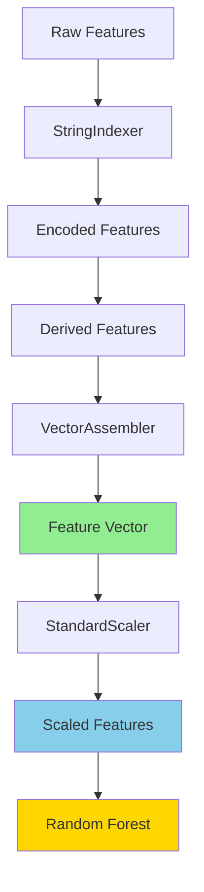
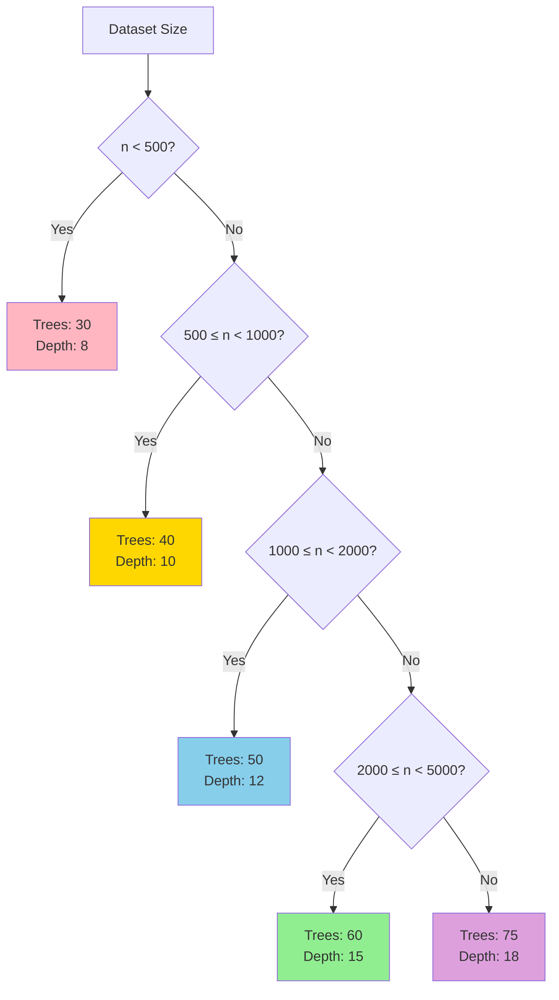

# ML Training Pipeline - Quick Reference

## Simplified Flow Diagram

```mermaid
graph LR
    A[Cassandra<br/>job_postings] --> B[Load Data]
    B --> C[Preprocess<br/>Clean & Filter]
    C --> D[Feature Engineering<br/>Encode & Create Features]
    D --> E[Split Data<br/>80% Train / 20% Test]
    E --> F[Scale Features<br/>StandardScaler]
    F --> G[Train Model<br/>Random Forest]
    G --> H[Evaluate<br/>MAE, RMSE, R²]
    H --> I[Save Model<br/>Disk + Cassandra]
    
    style A fill:#FFE4B5
    style G fill:#87CEEB
    style H fill:#FFD700
    style I fill:#DDA0DD
```

## Training Steps Overview

### 1️⃣ **Initialize** (Setup)
- Create SparkSession
- Configure Cassandra connector
- Set up Windows compatibility (if needed)

### 2️⃣ **Load Data** 
- Read from `job_analytics.job_postings`
- Apply optional limit
- Return Spark DataFrame

### 3️⃣ **Preprocess**
- Fill missing values
- Filter invalid salaries
- Remove outliers (top/bottom 1%)

### 4️⃣ **Feature Engineering**
- Create: `num_skills`, `num_fields`, `title_length`
- Encode: `city`, `job_type`, `position_level`, `experience`
- Assemble: Combine into feature vector

### 5️⃣ **Split & Scale**
- Split: 80% train, 20% test
- Scale: StandardScaler (mean=0, std=1)

### 6️⃣ **Train**
- Random Forest Regressor
- Auto-tune hyperparameters by data size
- Train on scaled features

### 7️⃣ **Evaluate**
- Predict on train & test sets
- Calculate: MAE, RMSE, R²
- Show feature importance

### 8️⃣ **Save**
- Model → Disk
- Scaler → Disk  
- Metadata → Cassandra

## Feature Pipeline

## Hyperparameter Selection

## Key Metrics Explained

| Metric | Formula | Meaning | Good Value |
|--------|---------|--------|------------|
| **MAE** | `mean(\|actual - predicted\|)` | Average error | Lower is better |
| **RMSE** | `sqrt(mean((actual - predicted)²))` | Penalizes large errors | Lower is better |
| **R²** | `1 - (SS_res / SS_tot)` | Variance explained | Closer to 1.0 is better |

## Quick Checklist

- [ ] Cassandra is running
- [ ] Data exists in `job_analytics.job_postings`
- [ ] Spark session initialized
- [ ] Data loaded successfully
- [ ] Preprocessing completed
- [ ] Features prepared
- [ ] Model trained
- [ ] Metrics evaluated
- [ ] Model saved to disk
- [ ] Metadata saved to Cassandra
