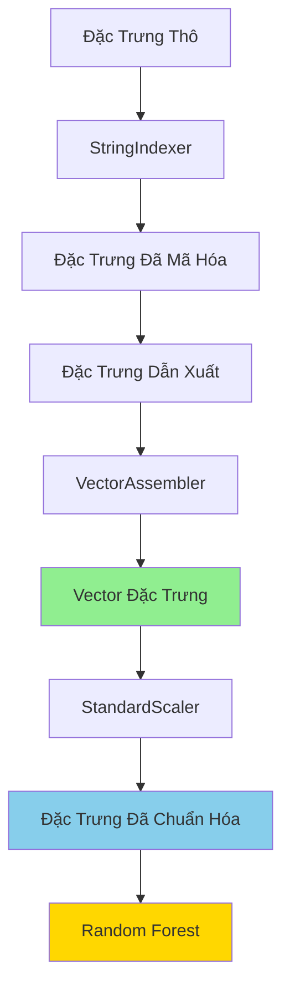
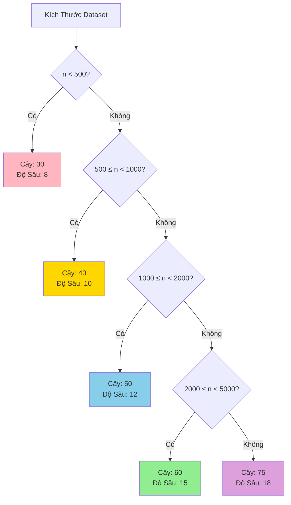

# Quy Trình Huấn Luyện ML - Tài Liệu Tham Khảo Nhanh

## Sơ Đồ Luồng Đơn Giản

```mermaid
graph LR
    A[Cassandra<br/>job_postings] --> B[Tải Dữ Liệu]
    B --> C[Tiền Xử Lý<br/>Làm Sạch & Lọc]
    C --> D[Kỹ Thuật Đặc Trưng<br/>Mã Hóa & Tạo Đặc Trưng]
    D --> E[Chia Dữ Liệu<br/>80% Train / 20% Test]
    E --> F[Chuẩn Hóa Đặc Trưng<br/>StandardScaler]
    F --> G[Huấn Luyện Mô Hình<br/>Random Forest]
    G --> H[Đánh Giá<br/>MAE, RMSE, R²]
    H --> I[Lưu Mô Hình<br/>Đĩa + Cassandra]
    
    style A fill:#FFE4B5
    style G fill:#87CEEB
    style H fill:#FFD700
    style I fill:#DDA0DD
```



## Tổng Quan Các Bước Huấn Luyện

### 1️⃣ **Khởi Tạo** (Thiết Lập)
- Tạo SparkSession
- Cấu hình Cassandra connector
- Thiết lập tương thích Windows (nếu cần)

### 2️⃣ **Tải Dữ Liệu** 
- Đọc từ `job_analytics.job_postings`
- Áp dụng giới hạn tùy chọn
- Trả về Spark DataFrame

### 3️⃣ **Tiền Xử Lý**
- Điền giá trị thiếu
- Lọc lương không hợp lệ
- Loại bỏ ngoại lai (1% trên/dưới)

### 4️⃣ **Kỹ Thuật Đặc Trưng**
- Tạo: `num_skills`, `num_fields`, `title_length`
- Mã hóa: `city`, `job_type`, `position_level`, `experience`
- Kết hợp: Gộp thành vector đặc trưng

### 5️⃣ **Chia & Chuẩn Hóa**
- Chia: 80% train, 20% test
- Chuẩn hóa: StandardScaler (mean=0, std=1)

### 6️⃣ **Huấn Luyện**
- Random Forest Regressor
- Tự động điều chỉnh siêu tham số theo kích thước dữ liệu
- Huấn luyện trên đặc trưng đã chuẩn hóa

### 7️⃣ **Đánh Giá**
- Dự đoán trên tập train & test
- Tính toán: MAE, RMSE, R²
- Hiển thị tầm quan trọng đặc trưng

### 8️⃣ **Lưu**
- Mô hình → Đĩa
- Scaler → Đĩa  
- Metadata → Cassandra

## Pipeline Đặc Trưng



## Lựa Chọn Siêu Tham Số



## Giải Thích Các Chỉ Số Chính

| Chỉ Số | Công Thức | Ý Nghĩa | Giá Trị Tốt |
|--------|-----------|---------|-------------|
| **MAE** | `mean(\|actual - predicted\|)` | Lỗi trung bình | Thấp hơn tốt hơn |
| **RMSE** | `sqrt(mean((actual - predicted)²))` | Phạt lỗi lớn | Thấp hơn tốt hơn |
| **R²** | `1 - (SS_res / SS_tot)` | Phương sai được giải thích | Gần 1.0 tốt hơn |

## Danh Sách Kiểm Tra Nhanh

- [ ] Cassandra đang chạy
- [ ] Dữ liệu tồn tại trong `job_analytics.job_postings`
- [ ] Spark session đã khởi tạo
- [ ] Dữ liệu đã tải thành công
- [ ] Tiền xử lý đã hoàn thành
- [ ] Đặc trưng đã được chuẩn bị
- [ ] Mô hình đã được huấn luyện
- [ ] Chỉ số đã được đánh giá
- [ ] Mô hình đã được lưu vào đĩa
- [ ] Metadata đã được lưu vào Cassandra

## Các Đặc Trưng Được Tạo

### Đặc Trưng Phân Loại (Đã Mã Hóa)
1. **city_encoded** - Chỉ số thành phố
2. **job_type_encoded** - Chỉ số loại công việc
3. **position_encoded** - Chỉ số cấp độ vị trí
4. **experience_encoded** - Chỉ số kinh nghiệm

### Đặc Trưng Số
5. **num_skills** - Số lượng kỹ năng
6. **num_fields** - Số lượng lĩnh vực
7. **title_length** - Độ dài tiêu đề

**Tổng cộng: 7 đặc trưng**

## Quy Trình Xử Lý Dữ Liệu

```
Dữ Liệu Thô
    ↓
Làm Sạch (fillna, filter)
    ↓
Tạo Đặc Trưng (num_skills, num_fields, title_length)
    ↓
Mã Hóa (StringIndexer cho 4 biến phân loại)
    ↓
Kết Hợp (VectorAssembler → vector 7 chiều)
    ↓
Chuẩn Hóa (StandardScaler → scaled_features)
    ↓
Huấn Luyện (Random Forest)
```

## Lưu Ý Quan Trọng

### ⚠️ Trước Khi Huấn Luyện
- Đảm bảo Cassandra đang chạy
- Kiểm tra dữ liệu có trong bảng
- Xác minh kết nối Spark-Cassandra

### ✅ Sau Khi Huấn Luyện
- Kiểm tra chỉ số R² (nên > 0.7)
- Xem xét tầm quan trọng đặc trưng
- Lưu cả mô hình và scaler
- Lưu metadata vào Cassandra để theo dõi

### 🔧 Tối Ưu Hóa
- Tăng dữ liệu → Tăng độ chính xác
- Điều chỉnh siêu tham số → Cân bằng tốc độ/chính xác
- Xử lý ngoại lai → Cải thiện hiệu suất

## Ví Dụ Kết Quả

### Chỉ Số Mẫu (Tốt)
- **R² Score**: 0.85 (85% phương sai được giải thích)
- **MAE**: 2.5 triệu VND (lỗi trung bình)
- **RMSE**: 3.8 triệu VND (phạt lỗi lớn)

### Tầm Quan Trọng Đặc Trưng (Mẫu)
1. position_encoded: 0.35
2. city_encoded: 0.25
3. experience_encoded: 0.20
4. num_skills: 0.10
5. job_type_encoded: 0.05
6. num_fields: 0.03
7. title_length: 0.02

## Liên Kết Nhanh

- **File Huấn Luyện**: `spark/app/ml_train_from_cassandra_pyspark.py`
- **UI Dashboard**: `spark/app/ml_training_ui.py`
- **Tài Liệu Chi Tiết**: `ML_TRAINING_PIPELINE_DOCUMENTATION_VI.md`
